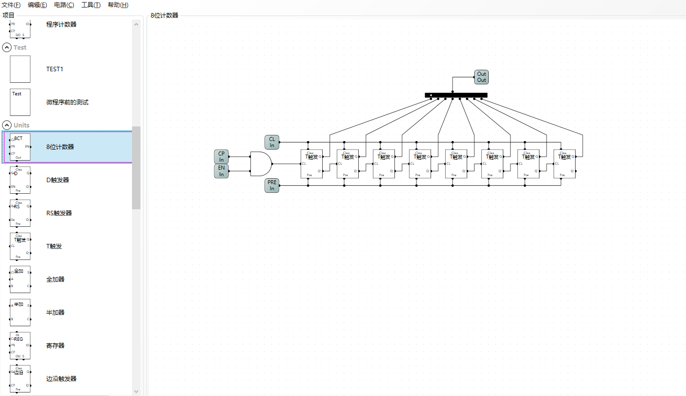
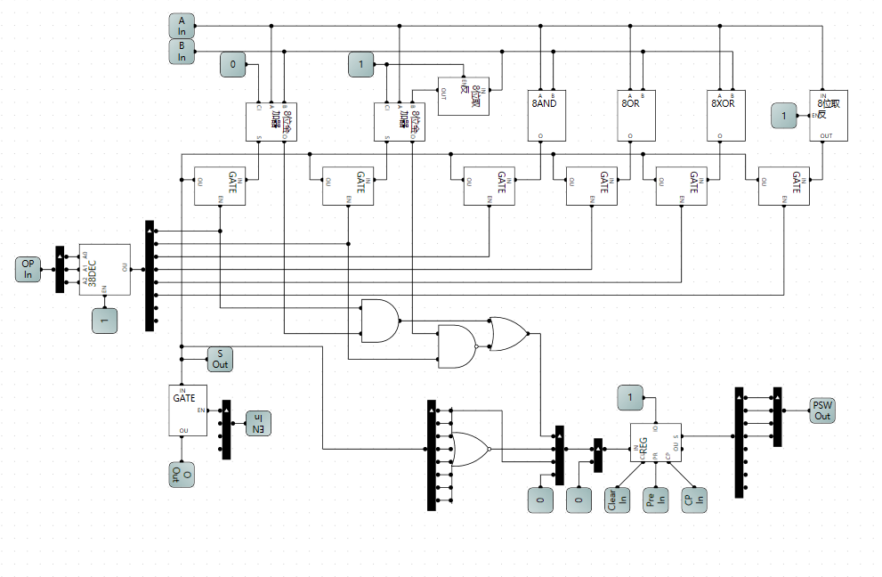
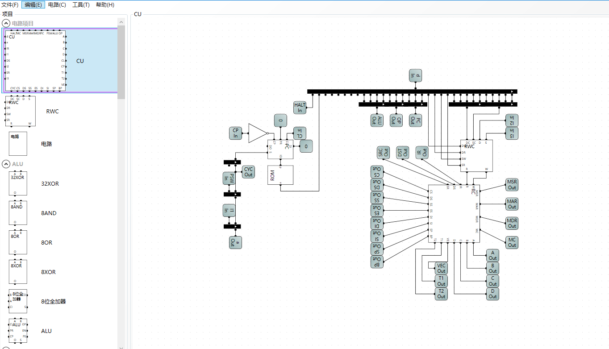
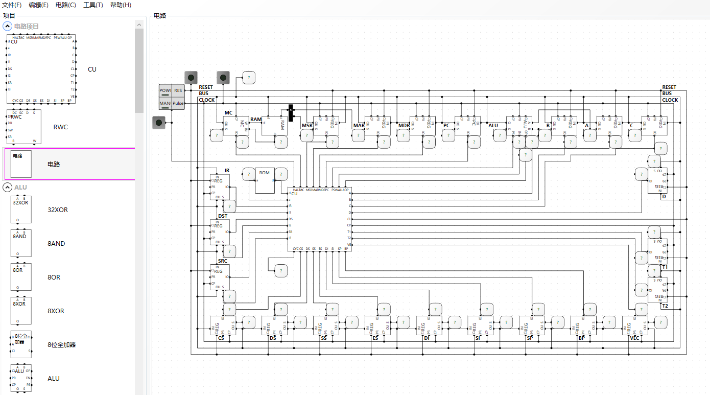

# 概述
利用[LogicalCircuit软件](https://www.logiccircuit.org/)从基本门电路实现一个8位2进制CPU，并做相应的指令集汇编编译器，学习过程参考[B站大佬](https://www.bilibili.com/video/BV1aP4y1s7Vf?spm_id_from=333.999.0.0) 

---

## 流程记录
 

---
 

---
 

---
 